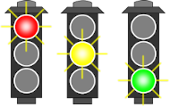

TD n°1
======

Exercice 1 : Cars
-----------------


Un client fait appel à nous pour développer un jeu vidéo de courses automobiles. Un joueur doit pouvoir conduire plusieurs sortes de voitures, dont une Subaru, une Jeep et une Fiat Multipla. Toutes les voitures font le plein de la même manière mais chacune accélère différemment (perdant ainsi plus ou moins de carburant) et klaxonne de façon unique.

#### Questions

1. Proposez une hiérarchie de classes avec attributs et méthodes pour représenter les voitures.
2. Implémentez ces classes en Java.
3. L'exécution du programme [`CarApp`](./CarApp.java), dont le code est fournit, doit s'exécuter en ligne de commande comme ceci :
```bash
$ java CarAppV1
Subarau créée.
Plein de la Subaru effectué.
Klaxon : Turlututu !
Accélération : ZRRRRRRROUMMMMMMMMMM !
Jeep créée
Plein de la Jeep effectué.
Klaxon : Buuuuuup Buuuuuup !
Accélération : Jiiiiiiiiionnnnnn !
...
```
4. Quel Design Pattern vous semblerait adapté pour construire ces voitures avec moins de dépendances ?
5. Complétez et/ou modifiez votre diagramme de classe pour utiliser ce Design Pattern afin de permettre de créer des voitures sans connaître leur type concret.
6. Créez un second programme qui s'exécute en ligne de commande comme ceci :
```bash
$ java CarAppV2 Subaru
Plein de la Subaru effectué.
Klaxon : Turlututu !
Accélération : ZRRRRRRROUMMMMMMMMMM !
```

Exercice 2 : Feu tricolore
--------------------------



### Justin Feu

Nous souhaitons modéliser un feu de circulation de la façon suivante :

- un état qui indique si le feu est allumé ou éteint,
- une couleur qui peut être verte, orange ou rouge.

Un feu possède :

- un interrupteur qui permet de changer son statut allumé/éteint,
- un bouton qui permet de passer à la couleur suivante.

#### Questions

1. Proposez un diagramme de classes pour modéliser ce feu.
1. Implémentez ce feu en java.
1. Écrivez un programme qui crée un feu, l'allume puis passe 5 fois à la couleur suivante, en affichant l'état complet du feu (on/off + couleur) après chaque modification du feu.

### Un feu - deux modes

Nous souhaitons maintenant pouvoir ajouter un nouveau bouton qui permet de modifier **à la demande** le mode de fonctionnement du feu. Nous proposons 2 modes pour commencer :

- le mode "français" avec un cycle vert, orange, rouge.
- le mode "allemand" avec un cycle vert, orange, rouge, orange.

La modification du mode de fonctionnement peut avoir lieu à n'importe quel moment, l'alternance des couleurs s'adapte immédiatement.

#### Suite des questions

4. Quel Design Pattern permettrait de répondre à cette demande de façon efficace ?
4. Proposez une seconde version du diagramme de classes utilisant ce Design Pattern pour permettre la modification du mode de fonctionnement.
4. Adaptez votre code Java à cette nouvelle modélisation.
4. Ajoutez des instructions à votre programme principal pour qu'il :
	- modifie son mode de fonctionnement,
	- passe 5 fois à la couleur suivante.
