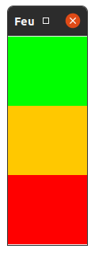
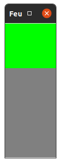
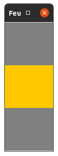
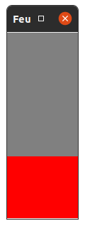
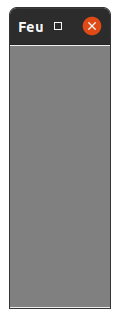
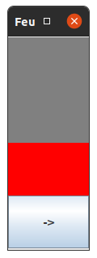
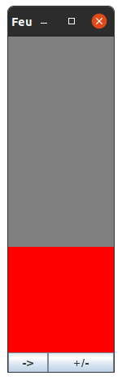
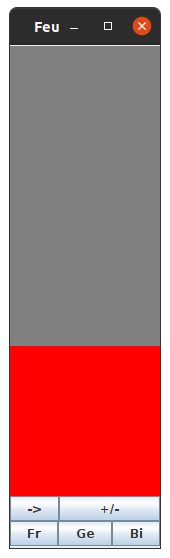

TD n°3
======

Exercice 1 : Feu tricolore graphique
------------------------------------

| Question 1 | Question 2 |
|------------|------------|
|  |     |

Les couleurs en version textuelle c'est bien, mais une vue graphique c'est mieux. Nous allons compléter notre code existant en créant une fenêtre qui simule un feu.

> Note :
> - Pour chaque question nécessitant de créer ou modifier une classe, commencez par mettre à jour votre diagramme de classe.
> - Votre diagramme doit être à jour avec votre code au début de chaque question.

#### Un feu statique

1. Créez une fenêtre graphique avec Swing, composée de 3 `JLabel` en colonne avec respectivement une couleur d'arrière-plan verte, orange et rouge. 
   - Choisissez un "layout" adapté.
   - La méthode `setOpaque` de la classe `JLabel` vous sera utile.
   - Pour cette question, créez et affichez simplement une fenêtre dans votre classe qui contient le `main()`, en plus du code déjà présent.
2. Faites-en sorte que la fenêtre soit initialisée en fonction de l'état d'un feu : éteint, vert, orange ou rouge.

#### Un feu dynamique

3. Commencez par ajouter une temporisation après chaque changement d'état du feu à l'aide de l'instruction `Thread.sleep(1000);` et constatez que l'affichage du texte en console est progressif.
4. Transformez la fenêtre en un observateur d'un feu, tout comme l'est déjà la gestion de l'affichage :
   - Complétez la classe de la fenêtre.
   - Initialisez le processus d'observation du modèle par les vues dans la classe contenant le `main()`

#### Passage au MVC

5. Créez des packages `view`, `model` et `controller` et déplacez les classes existantes dans leurs packages respectifs. À vous de trouver le bon package de chaque classe.
6. Créez un contrôleur qui serve de Facade (le patron de conception) entre le `main()` et le reste de l'application. Votre classe contenant le `main()` ne doit plus être responsable que :
   - de la création des modèles et vues
   - de la mise en place du processus d'observation du modèle par les vues
   - des appels au contrôleur pour l'enchaînement des états du feu.
   
En d'autres termes, la classe du `main()` ne doit plus dépendre que du feu, des deux vues et du contrôleur. À vous de décider quels attributs et quelles méthodes sont nécessaires dans la classe du contrôleur pour répondre à cette contrainte.

#### Gestion manuelle du feu

| Question 7 | Question 8 | Question 9 |
|------------|------------|------------|
|  |  |  |

Commencez par supprimer toutes les actions effectuées par la classe du `main()` sur le feu : les questions suivantes vont progressivement ajouter la possibilité de modifier le feu grâce à des actions de l'utilisateur.  

> Note : **Toutes les questions qui suivent doivent respecter les principes du MVC.**

7. Ajoutez un bouton en dessous du feu qui permette de passer à la couleur suivante du feu.
8. Ajoutez un bouton qui permette d'éteindre/allumer le feu. Ce bouton doit se placer **à côté** du premier bouton.
9. Ajoutez 3 boutons qui permettent de sélectionner le type de feu (français, allemand, bicolore). Ces trois boutons doivent être placés en-dessous des deux autres déjà en place. 

#### Bonus

Pour les plus rapides, vous pouvez :

1. Désactivez le bouton qui passe à la couleur suivante lorsque le feu est éteint et le réactiver lorsqu'il est allumé. 
2. Transformez les 3 boutons de langue en boutons radios.
3. Ajoutez deux champs "input" pour sélectionner le nombre d'itérations à réaliser lorsqu'on clique sur le bouton de changement de couleur, ainsi que la durée de la temporisation.