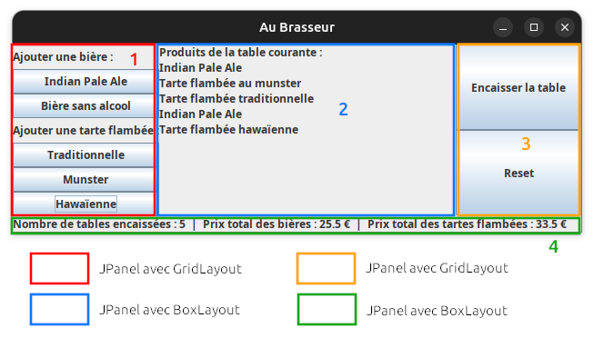
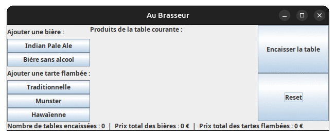

Au Brasseur
===========

### Consignes générales

- Tous les documents sont autorisés (cours, TDs, TPs, internet)
- Il est strictement interdit de communiquer de quelque façon que ce soit avec qui que ce soit.
- L'utilisation de Github Copilot est tolérée, sans sa partie "chat".
- L'utilisation d'autres outils d'IA comme ChatGPT, directement ou à travers des plugins d'IDE, est interdite.
- Les téléphones et oreillettes sont interdits.
- Toute tentative de fraude sera sanctionnée d'un 0.

### Préparation du dépôt Git

- L'URL de votre dépôt Git doit être de la forme https://git.unistra.fr/[votre_login_unistra]/a31, renommez-le si ce n'est pas le cas via le menu "Settings -> General -> Advanced -> Change Path" sur Gitlab
- Votre dépôt doit être privé et vous devez ajouter votre enseignant de TD ainsi que le responsable du module comme Reporter.

### Rendu

Le rendu est à faire sur votre dépôt, **dans le répertoire nommé "TP-note" à la racine de votre dépôt : merci de en pas le renommer**.

* Pensez à "commiter" au fur et à mesure du TP noté, dès que vous avez une partie fonctionnelle.
* N'oubliez pas de "pusher" à la fin du TP noté.
* Attention, **les commits effectués APRÈS l'horaire de fin du TP ne seront pas pris en compte** : pensez à prendre le temps nécessaire à ces opérations avant l'heure fatidique.

Sujet
-----

"Au Brasseur" est un restaurant Strasbourgeois qui propose essentiellement **des tartes flambées et des bières**. Le propriétaire vous a contacté pour informatiser sa caisse. Il vous demande de réaliser **une application qui permet de gérer l'encaissement des tables** à la fin des repas.

Il vous demande une première version beta qui gère les produits suivants :  

- des bières Indian Pale Ale (IPA) à 6€ et une bière sans alcool à 4,50€
- des tartes flambées traditionnelles à 5€, munster à 6€ et hawaïenne à 6,50€

**Complétez le diagramme de classes [`auBrasseur.puml`](diags/auBrasseur.puml) avec PlantUML et réalisez une implémentation en Java de cette application, en respectant les contraintes ci-dessous.**

##### 1. Contraintes fonctionnelles

Votre application doit **gérer une seule table active à la fois** et doit permettre :

- de **(ré)initialiser** la caisse
- de **marquer** la table active comme encaissée
- de **créer une nouvelle table** dès que la table active est marquée comme encaissée
- d'**ajouter/supprimer des plats** et boissons à la table active
- d'**afficher** à tout instant et séparément **la somme totale des boissons et celle des tartes flambées**, accumulée depuis l'ouverture de la caisse par toutes les tables déjà encaissées

À noter :

- une table encaissée ne peut pas redevenir active.
- Un produit ajouté ne peut pas être supprimé.

##### 2. Contraintes de conception

Votre conception doit :

- respecter l'architecture **MVC**
- utiliser les patrons de conception :
  - **Factory** pour la création des produits
  - **Observer** entre la vue et le modèle, **de façon pertinente**

##### 3. Contraintes de code

Vos sources doivent être placées dans le répertoire `src`.
La classe principale [`AuBrasseur`](src/aubrasseur/AuBrasseur.java) ne doit être ni modifiée ni déplacée. Elle doit contenir la méthode `main` suivante :

```java
public static void main(String[] args) {
	CashDesk model = new CashDesk();
	AuBrasseurController controller = new AuBrasseurController(model);
	AuBrasseurWindow view = new AuBrasseurWindow(model,controller);
	model.addObserver(view);
}
```

##### 4. Contraintes graphiques

Votre interface graphique doit afficher :

- le contenu de la table en cours
- le nombre de tables encaissées
- le montant total des bières des tables encaissées
- le montant total des tartes flambées des tables encaissées

et proposer des boutons pour :

- ouvrir/fermer la caisse
- ajouter individuellement un exemplaire de chaque produit à la table en cours
- encaisser la table en cours
- réinitialiser la caisse

Le conteneur principal de votre application doit être organisé dans un `BorderLayout` et contenir les éléments suivants :



Exemple d'enchainements de clics :

